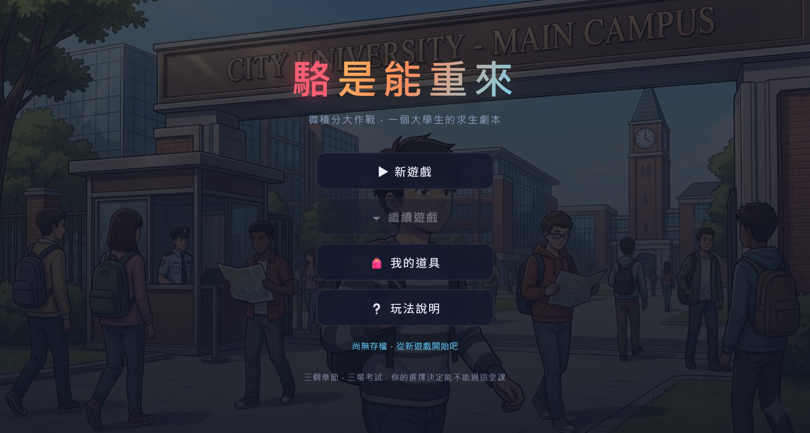

# 駱是能重來 — 微積分大作戰

一個以「大學生修微積分」為主題的沉浸式選擇劇情 RPG 網站。

**[▶ 立即遊玩](https://play.cornhsu.com/luo-again/) · [作品介紹與開發故事](https://cornhsu.com/luo-again)**



> 你扮演一名大一新生,要在一學期內修完全系死當率第一的「微積分」。
> 你的每一個選擇、每一次熬夜、每一題作答,都會決定這學期到底能不能過。

純網頁遊戲,開瀏覽器直接開始,免安裝、免登入。存檔在瀏覽器 localStorage,請固定用同一個瀏覽器。

## 特色

| | |
|---|---|
| 🎭 沉浸式分支劇情 | 對話式敘事,選擇改變劇情走向與結局 |
| 📈 準備度系統 | 每個選擇影響準備度,分數還會讓劇情分歧 |
| 🎒 道具求生包 | 開局發全套道具,自己決定「何時、哪場考試」使用 |
| 😵 熬夜疲勞機制 | 熬夜能衝準備度,但會累積疲勞、考試扣分 |
| 🎲 隨機題庫 × 難度分級 | 每場從題庫隨機抽題、選項打亂,三場難度遞增 |
| ⚖️ 加權計分 | 小考 20%、期中 35%、期末 45%,越後面越關鍵 |
| 📩 補考救贖關卡 | 邊緣不及格可補考翻盤,真正的最後一搏 |
| 💾 章節存檔 | 每章結束自動存檔,可從大廳繼續 |
| 🖼️ 全場景手繪背景 | 每個場景都有對應插圖,統一畫風 |

## 玩法
- **大廳**：新遊戲 / 繼續遊戲 / 我的道具 / 玩法說明
- **三章節**：小考 → 期中考 → 期末考，每章都是分支劇情
- **選擇影響劇情**：每個選擇改變「準備度」並走向不同分支
- **道具系統**：某些選擇給道具（筆記、考古題、能量飲料…），考試前可使用加分
- **存檔點**：每章結束自動存檔（localStorage），可從大廳繼續
- **考試**：成績 ＝ 準備度 ＋ 道具加分 ＋ 答題得分（上限 100）
- **結算**：依三科平均判定
  - 75↑ 順利通過 ｜ 60–74 低空飛過(預警) ｜ 50–59 補考 ｜ 50↓ 重修

## 執行方式
直接用瀏覽器開啟 `index.html` 即可，無需安裝任何東西。

## 檔案結構
```
index.html      畫面結構（大廳 / 遊戲 / 結算）
css/style.css   樣式
js/story.js     劇情資料（場景、道具、判定）— 想改劇情只動這裡
js/game.js      遊戲引擎（狀態、存檔、渲染、考試邏輯）
```

## 想擴充劇情？
編輯 `js/story.js`：每個場景用 id 索引，`choices` 內可設定 `points`（加準備度）、`item`（給道具）、`flag`（劇情旗標）、`next`（下一個場景）。新增章節照同樣格式即可。
